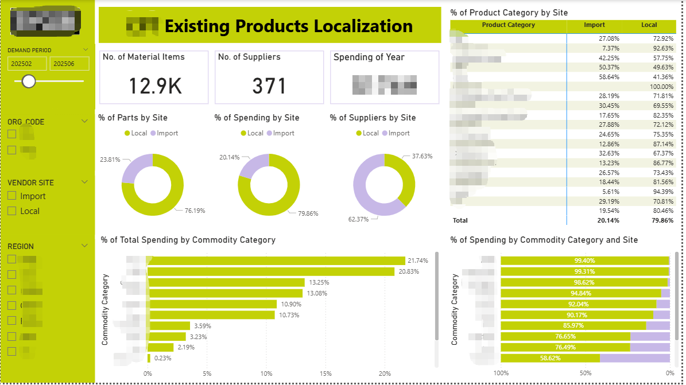

# Local vs. Imported Sourcing Analysis

## Project Overview
This project analyzes procurement datasets to determine the distribution of **Local vs. Imported** components.

### Challenges
- **Massive Datasets:** Handled large-scale raw data.
- **Non-Standardized Data:** Cleaned inconsistent formats and fragmented sources.

### Methodology & Tools
- **Python (Pandas):** Used for automated ETL and data cleaning.
- **Power BI:** Developed an interactive dashboard for visualization.

### Key Outcomes
- Visualized **Sourcing Value Distribution**.
- Identified categories with the highest localization rates.
  

